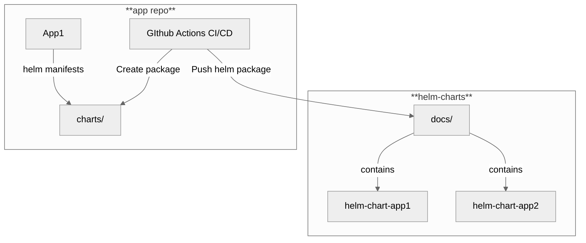

# Helm Chart Release GitHub Action

This GitHub Action packages a Helm chart and uploads it to a specified Helm repository.  
You need a preconfigured helm-charts repository setup with Github Pages to serve your charts.  

***The repos need to be accessible from the same PAT otherwise it wont work.***  
***Also, it works only for a single helm chart and it will take the name from the Chart.yaml***  

## Inputs

- `chart-path`: Path to the Helm chart directory where this workflow runs **(required)**.
- `github-token`: GitHub PAT token for pushing the Helm chart to the repository **(required)**.
- `helm-repo`: The GitHub repository where Helm charts are stored **(required)**.
- `helm-repo-folder`: In which folder in the helm-repo to put the release **(required)**.
- `branch-name`: Name of the branch to deploy to. Default master **(required)**.

## Example Usage

```yaml
name: Create Helm Release

on:
  workflow_dispatch:
  push:
    branches:
      - master

jobs:
  create-release:
    runs-on: ubuntu-latest

    steps:
      # Step 1: Checkout the repository with Helm manifests
      - name: Checkout Helm Manifests
        uses: actions/checkout@v4

      # Step 2: Use Custom Helm Chart Release Action
      - name: Create Helm Chart Release
        uses: xamma/helm-release-action@v1.0.4
        with:
          chart-path: './charts/my-chart'  # relative Path to your chart directory where your helmfiles are
          github-token: ${{ secrets.MY_PAT }}  # GitHub PAT token for authentication
          helm-repo: '<your-username>/<helm-charts-repo>'  # Repo for Helm charts (format: user/repo)
          helm-repo-folder: 'docs'  # whats the name of the folder in your helm-charts repo
          branch-name: 'master' # name of the branch in your helm-charts repo
```

## Workflow
